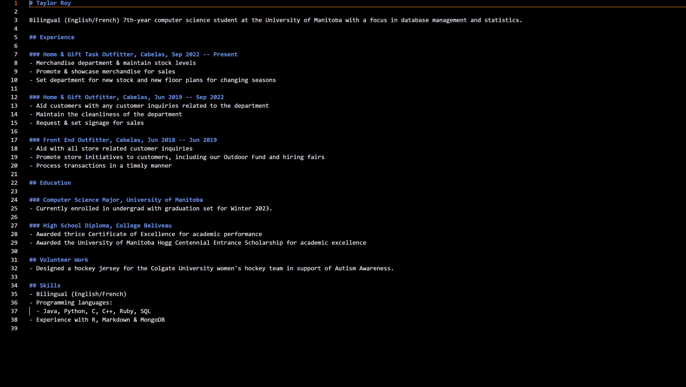

# README

## Purpose

The purpose of this README is to demonstrate how you can host and format your own resume using Markdown, StackEdit, Github Pages and Jekyll. This demonstration will be performed by relating what we have learned from Andrew Etter's book *Modern Technical Writing*.

## Prerequisites

* Resume formatted in Markdown
  * (Optional) Markdown Editor ([local](https://typora.io/) or [web-based](https://stackedit.io))
* [GitHub account](https://github.com/)
* [Ruby](https://www.ruby-lang.org/en/downloads/)
* [RubyGems](https://rubygems.org/pages/download)
* [GCC](https://gcc.gnu.org/install/)
* [Jekyll](https://jekyllrb.com/docs/installation/windows/)

## Instructions

### Step 1: Acquire the prerequisites

1. Install the prerequisites listed above

Markdown is a popular markup language used by web editors to produce content easily online. It is more lightweight compared to other markup languages such as XML, meaning it is much more readable and user-friendly.[^1]  
Jekyll is a static website generator that allows its users to create and host their own websites. Static websites are perfect to use for hosting a site as simple as a resume. It allows for the usage of pages from Markdown files that can be added and edited whenever needed.[^2] As your resume should be a single page (or many, to your choosing), Jekyll provides a simple and easy to use resource to host your website. 

### Step 2: Create a new repository on GitHub

1. Create a new public repository
2. Name the repository as `[your-github-username].github.io`
    * This will be the link you will use to later access your website.

### Step 3: Create your Jekyll site

1. Create a Jekyll site `resume`
    * In the terminal, enter `jekyll new resume`.
2. Change into your new `resume` directory
    *  In the terminal, enter `cd resume`.
3. Add `gem "webrick"` on a new line in the Gemfile
4. Build the site locally
    * In the terminal, enter `bundle exec jekyll serve`.
5. Access your website locally
    * In your web browser, visit `http://localhost:4000`.

You will now be seeing the default Jekyll website.

### Step 4: Upload your resume to your website

*Showcasing substeps 2 through 4*

1. Rename your Markdown-formatted resume to `index.markdown`
    * This will display your resume as the homepage to your website.
2. Add a header to your Markdown-formatted resume
3. Add `layout: home` to your header
4. Add `title: [your-title]` to your header
5. Remove the `about.markdown` file from the repository
6. Remove the plugins from the `_configs.yml` file in the repository

### Step 5: Host your website using GitHub Pages

1. Open your repository settings
2. Navigate to `Pages` on the sidebar under `Code and automation`
3. Select `Deploy from branch` for source
4. Select the branch you would like to deploy from
5. Save your settings
6. Visit `[your-github-username].github.io`

Your website should now be hosted.

### Step 6: Customize

There are plenty of available themes to choose from for Jekyll. Check More Resources below for a range of resume Jekyll themes. 

## More Resources

* [GitHub Flavoured Markdown Tutorial](https://github.github.com/gfm/)
* [Andrew Etter's *Modern Technical Writing*](https://www.amazon.ca/Modern-Technical-Writing-Introduction-Documentation-ebook/dp/B01A2QL9SS)
* [Jekyll Resume Themes](https://jekyllthemes.dev/tag/resume/)

## Authors & Acknowledgements

Authored by Taylor Roy.  
Concepts related from Andrew Etter's *Modern Technical Writing* 
Peer reviewed by Vedant Pulahru, Josh Sigurdson & Mansomar Singh.

## FAQs

1. Why is Markdown better than a word processor?
    * Markdown is better than a wood processor as it allows the user a lot more freedom for formatting, and later for publishing. Markdown and all its flavours allow web writers to produce static web content much easier without having to write in the less readable HTML. 

2. Why is my resume not showing up?
    * If you are able to run your website through Jekyll and your resume is not showing up, there may be a few potential solutions. Firstly, check and see if your resume Markdown file is located in your Jekyll repository. This will be the same folder/directory containing your Gemfile. If it still is not showing up, try adding "layout: page" to your Markdown header within your resume file. 

## References

[^1] Andrew Etter's *Modern Technical Writing*., p. 33
[^2] Andrew Etter's *Modern Technical Writing*., p. 50